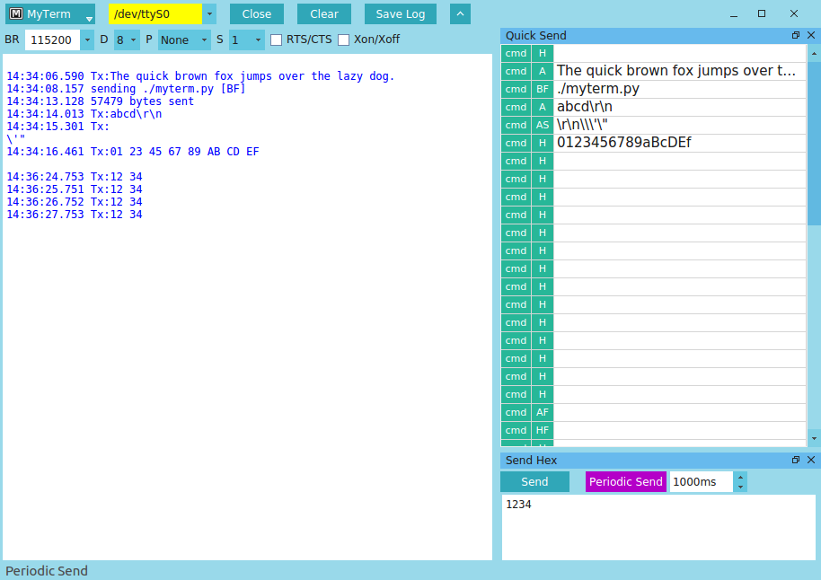

# UartVide    

  
  

UartVide is a flat-UI and lightweight RS232 serial port communication utility.  
Its features including
	
  * resizable and floatable windows
  * quick send custom commands
  * supported send formats: HEX, ASCII, ASCII(\r \n \t ...), Hex text file, ASCII text file, BIN/HEX file
  * detect the valid serial ports
  * display receive data either in hexadecimal or ASCII format

UartVide runs on Windows and Linux supported by [PySide2](https://pypi.org/project/PySide2/).  

The program icon made by <a href="https://www.flaticon.com/authors/flat-icons" title="Flat Icons">
Flat Icons</a> from <a href="https://www.flaticon.com/" title="Flaticon">www.flaticon.com</a>

Clear icon made by <a href="https://smashicons.com/" title="Smashicons">Smashicons</a>
from <a href="https://www.flaticon.com/" title="Flaticon">www.flaticon.com</a>

(MyTerm was renamed to UartVide from version 2.4)  

## License
UartVide is licensed under the GNU GPL v3.  
For detail see <a href="http://www.gnu.org/licenses/" title="GNU Licenses">http://www.gnu.org/licenses/</a>  

## Download
  

[Download UartVide(MyTerm) from Softpedia](http://www.softpedia.com/get/Network-Tools/Misc-Networking-Tools/MyTerm.shtml)  
  

## Screenshot

