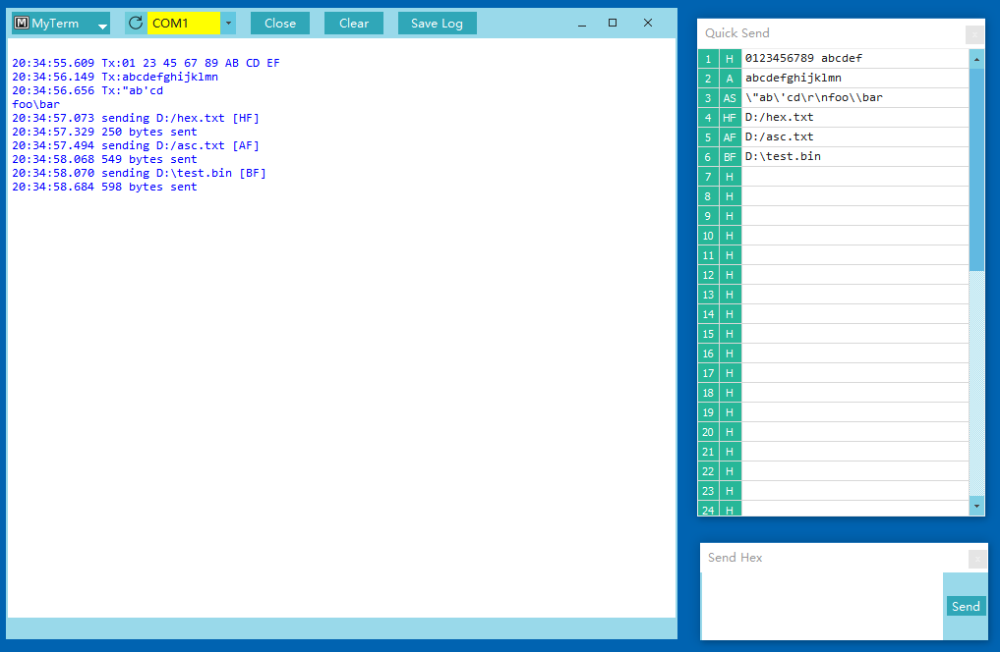

# MyTerm    

Mainly designed for embedded & software engineers, MyTerm is a flat-UI and straightforward and lightweight RS232 serial port communication utility that allows you to configure the connection parameters and communicate via the port.   
MyTerm runs on all platforms supported by PyQt including Windows, Linux.

Its features including  
* quick send custom commands  
* supported send formats: HEX, ASCII, ASCII(\r \n \t ...), Hex text file, ASCII text file, BIN/HEX file  
* detect the valid serial ports  
* display receive data either in hexadecimal or ASCII format  
* custom resizable and floatable windows  
  
MyTerm is licensed on all supported platforms under the GNU GPL v3.  
For detail see LICENSE.txt. 

## Download
### Windows Version  
  
  

  

[Download MyTerm from Softpedia](http://www.softpedia.com/get/Network-Tools/Misc-Networking-Tools/MyTerm.shtml)  
  

### Linux Version
The source code is executable in Linux.  
The package for Linux is being prepared.  

## Entirely new UI

