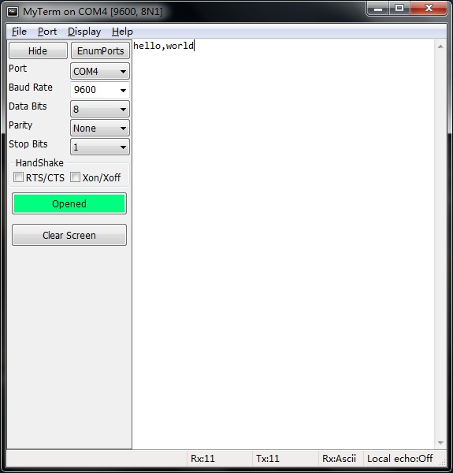
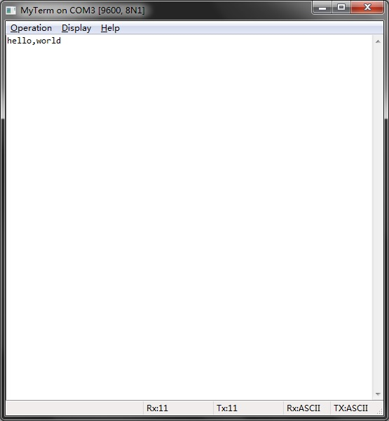

MyTerm
======
MyTerm is a RS232 serial port communication utility that can display the received data  
either in hexadecimal or ASCII format, allowing you to configure the connection parameters.

Its other features including detecting the valid serial ports,
echoing the sending data in local or not.

<table>
   <tr>
      <td>License</td>
      <td>BSD</td>
   </tr>
</table>

Download Windows Version
------------------------
<table>
   <tr>
      <td>Size</td>
      <td>5.4 MB</td>
   </tr>
   <tr>
      <td>OS</td>
      <td>Windows XP / Vista / 7 / 8 / 8 64 bit</td>
   </tr>
</table>
[Download MyTerm 1.3 from Softpedia](http://www.softpedia.com/get/Network-Tools/Misc-Networking-Tools/MyTerm.shtml)  
[Download MyTerm 1.3 from SourceForge](https://sourceforge.net/projects/myterm/)

Screenshot
----------

