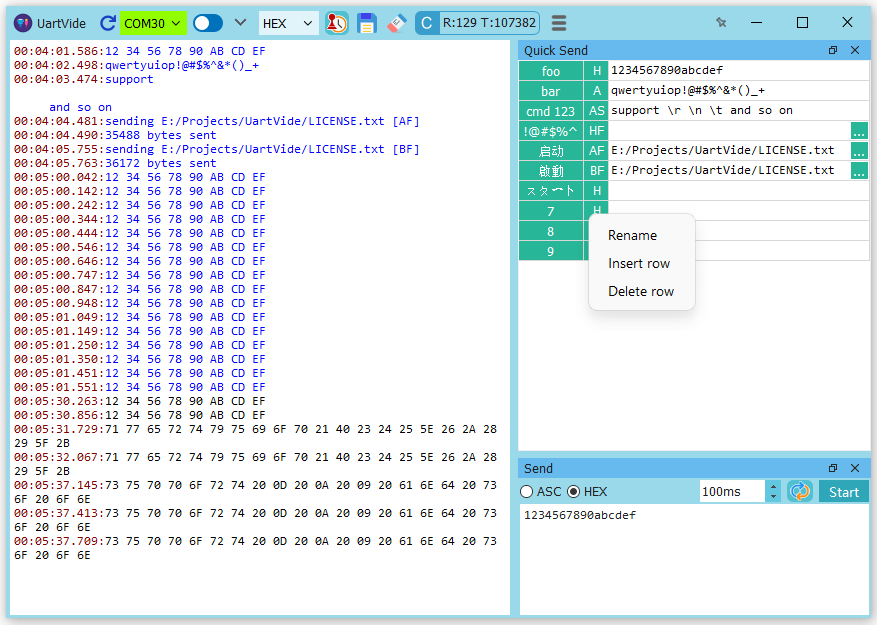

# MyTerm    
MyTerm is a flat UI RS232 serial port communication utility and runs on all platforms supported by PyQt including Windows, Linux.

Its features including  
* quick send custom commands  
* configure the connection parameters  
* detect the valid serial ports  
* echo the sending data in local or not  
* display data either in hexadecimal or ASCII format  
* custom resizable and floatable widgets  
  
MyTerm is licensed on all supported platforms under the GNU GPL v3.  
For detail see LICENSE.txt. 

## Download
### Windows Version
<table>
   <tr>
      <td>Size</td>
      <td>23.6 MB</td>
   </tr>
   <tr>
      <td>OS</td>
      <td>Windows Vista / 7 / 8 / 10</td>
   </tr>
</table>
[Download MyTerm from Softpedia](http://www.softpedia.com/get/Network-Tools/Misc-Networking-Tools/MyTerm.shtml)  

### Linux Version
The source code is executable in Linux.  
The package for Linux is being prepared.  

## Entirely new UI

